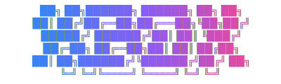

<p align="center">
  
</p>

<h3 align="center">Kubernetes deployments for humans</h3>

<p align="center">
  <a href="#installation">Installation</a> •
  <a href="#quick-start">Quick Start</a> •
  <a href="#features">Features</a> •
  <a href="#documentation">Documentation</a> •
  <a href="#configuration">Configuration</a>
</p>

<p align="center">
  
  
  
</p>

---

## Why kbox?

Kubernetes is powerful but complex. Deploying a simple app requires writing hundreds of lines of YAML across Deployments, Services, ConfigMaps, Secrets, ServiceAccounts, NetworkPolicies, HPAs, PDBs...

**kbox reduces this to 7 lines.**

```yaml
apiVersion: kbox.dev/v1
kind: App
metadata:
  name: myapp
spec:
  image: myapp:v1.0.0
  port: 8080
```

And you get **secure, production-ready defaults** out of the box:

- Non-root containers with read-only filesystem
- Resource limits and requests
- Network policies
- Service accounts with minimal permissions
- PDB auto-generated when replicas > 1

---

## Installation

### Build from Source

```bash
git clone https://github.com/bobbyrathoree/kbox.git
cd kbox
go build -o kbox ./cmd/kbox
sudo mv kbox /usr/local/bin/
```

### Verify Installation

```bash
kbox doctor
```

### Requirements

- **Docker** - For building images
- **kubectl** - Configured with cluster access
- **Kubernetes cluster** - kind, minikube, or any cloud provider (EKS, GKE, AKS)

Quick local setup:
```bash
# Install kind and create a cluster
kind create cluster
```

---

## Quick Start

### Zero-Config Deploy

Have a Dockerfile? That's all you need.

```bash
cd my-app
kbox up
```

kbox will:
1. Build your Docker image
2. Load it into your cluster
3. Create all necessary Kubernetes resources
4. Stream logs in real-time

### With Configuration

For more control, create a `kbox.yaml`:

```bash
kbox init                    # Auto-detect from Dockerfile
kbox deploy                  # Deploy to cluster
```

### Add a Database

```bash
kbox init                    # Create kbox.yaml first (if not exists)
kbox add postgres            # Add PostgreSQL
kbox deploy                  # Deploy with database
```

That's it. kbox creates a StatefulSet with persistent storage and injects `DATABASE_URL` into your app.

---

## Features

### Secure by Default

Every deployment includes hardened security settings that pass Pod Security Standards:

```yaml
# Automatically applied to all containers
securityContext:
  runAsNonRoot: true
  readOnlyRootFilesystem: true
  allowPrivilegeEscalation: false
  capabilities:
    drop: ["ALL"]
  seccompProfile:
    type: RuntimeDefault
```

Plus automatic **NetworkPolicies**, **ServiceAccounts** with disabled token automount, and **resource limits**.

### Production-Ready Infrastructure

| Feature | Auto-Generated | Trigger |
|---------|---------------|---------|
| Deployment | Always | Any config |
| Service | Always | `port` specified |
| ServiceAccount | Always | Security best practice |
| NetworkPolicy | Always | Security best practice |
| HPA | When configured | `autoscaling.enabled: true` |
| PDB | Automatic | `replicas > 1` or autoscaling |
| Secrets | When needed | Dependencies or `secrets:` |
| Ingress | On demand | `kbox expose` |

### Managed Dependencies

Add databases with one command. kbox handles StatefulSets, persistent storage, secrets, and connection strings.

```bash
kbox add postgres            # PostgreSQL with auto-generated password
kbox add redis               # Redis with authentication
kbox add mongodb             # MongoDB with auth
kbox add mysql               # MySQL with auth
```

Environment variables are automatically injected:

| Dependency | Injected Variables |
|------------|-------------------|
| PostgreSQL | `DATABASE_URL`, `PGHOST`, `PGPORT`, `PGUSER`, `PGPASSWORD`, `PGDATABASE` |
| Redis | `REDIS_URL`, `REDIS_HOST`, `REDIS_PORT`, `REDIS_PASSWORD` |
| MongoDB | `MONGODB_URL`, `MONGODB_HOST`, `MONGODB_PORT`, `MONGODB_USER`, `MONGODB_PASSWORD` |
| MySQL | `DATABASE_URL`, `MYSQL_HOST`, `MYSQL_PORT`, `MYSQL_USER`, `MYSQL_PASSWORD` |

### Multi-Environment Support

Define environment overlays in a single file:

```yaml
apiVersion: kbox.dev/v1
kind: App
metadata:
  name: myapp
spec:
  image: myapp:v1.0.0
  port: 8080
  replicas: 1

environments:
  staging:
    replicas: 2
    env:
      LOG_LEVEL: debug

  production:
    replicas: 5
    resources:
      memory: 512Mi
      cpu: 500m
    autoscaling:
      enabled: true
      minReplicas: 3
      maxReplicas: 20
```

```bash
kbox deploy -e staging       # Deploy to staging
kbox deploy -e production    # Deploy to production
```

### CI/CD Integration

Every command supports JSON output and CI mode:

```bash
kbox validate --strict --output=json    # Fail on warnings (like :latest tag)
kbox render --summary                   # Quick resource audit
kbox deploy --dry-run --output=json     # Preview changes
kbox deploy --ci --output=json          # Clean output for pipelines
```

Example GitHub Actions workflow:

```yaml
- name: Validate
  run: kbox validate --strict

- name: Preview
  run: kbox diff --output=json

- name: Deploy
  run: kbox deploy --ci -e production
```

### Developer Experience

| Command | Description |
|---------|-------------|
| `kbox up` | Build + deploy + stream logs (zero-config) |
| `kbox dev` | Watch mode: rebuild on file changes |
| `kbox logs <app>` | Logs with K8s events interleaved |
| `kbox shell <app>` | Shell into any container (even distroless!) |
| `kbox pf <app> <port>` | Port-forward to your app |
| `kbox status <app>` | Rich deployment status |

### Operations

| Command | Description |
|---------|-------------|
| `kbox deploy` | Deploy with Server-Side Apply |
| `kbox diff` | Preview what would change |
| `kbox rollback` | Instant rollback to previous release |
| `kbox history` | View release history |
| `kbox down` | Clean removal of all resources |

---

## Documentation

### Commands Reference

<details>
<summary><strong>kbox up</strong> - Zero-config deploy</summary>

Build from Dockerfile and deploy to cluster. Perfect for development.

```bash
kbox up                      # Build and deploy
kbox up --no-logs            # Deploy without streaming logs
kbox up -e staging           # Use environment overlay
```
</details>

<details>
<summary><strong>kbox deploy</strong> - Production deploy</summary>

Deploy using pre-built images. Ideal for CI/CD pipelines.

```bash
kbox deploy                  # Deploy current directory
kbox deploy -f app/kbox.yaml # Deploy specific config
kbox deploy -e production    # Use environment overlay
kbox deploy --dry-run        # Preview without applying
kbox deploy --no-wait        # Don't wait for rollout
```
</details>

<details>
<summary><strong>kbox validate</strong> - Config validation</summary>

Validate configuration before deployment.

```bash
kbox validate                # Validate with warnings
kbox validate --strict       # Fail on warnings (for CI)
kbox validate --output=json  # JSON output for automation
```
</details>

<details>
<summary><strong>kbox render</strong> - View generated YAML</summary>

See exactly what Kubernetes resources will be created.

```bash
kbox render                  # Full YAML output
kbox render --summary        # Resource count summary
kbox render --redact         # Hide secret values
kbox render | kubectl apply -f -  # Pipe to kubectl
```
</details>

<details>
<summary><strong>kbox logs</strong> - Enhanced logging</summary>

Stream logs with Kubernetes events interleaved for debugging.

```bash
kbox logs myapp              # Stream logs from app
kbox logs myapp --previous   # Logs from crashed container
kbox logs myapp -f           # Follow logs
```
</details>

<details>
<summary><strong>kbox shell</strong> - Container access</summary>

Get a shell in any container, including distroless images.

```bash
kbox shell myapp             # Interactive shell
kbox shell myapp -- ls /app  # Run single command
```
</details>

<details>
<summary><strong>kbox rollback</strong> - Instant recovery</summary>

Roll back to a previous release instantly.

```bash
kbox rollback myapp          # Rollback to previous release
kbox rollback myapp --to 3   # Rollback to specific revision
kbox history myapp           # View available revisions
```
</details>

---

## Configuration

### Full kbox.yaml Reference

```yaml
apiVersion: kbox.dev/v1
kind: App
metadata:
  name: myapp
  namespace: default           # Optional, defaults to current context

spec:
  # Image (required unless using kbox up)
  image: myregistry.io/myapp:v1.0.0

  # Build config (for kbox up)
  build:
    dockerfile: Dockerfile
    context: .

  # Networking
  port: 8080

  # Scaling
  replicas: 3
  autoscaling:
    enabled: true
    minReplicas: 2
    maxReplicas: 10
    targetCPUUtilization: 70

  # Resources
  resources:
    memory: 256Mi
    cpu: 200m
    memoryLimit: 512Mi
    cpuLimit: 500m

  # Health checks
  healthCheck: /health         # Creates liveness + readiness probes

  # Environment variables
  env:
    LOG_LEVEL: info
    FEATURE_FLAGS: "new-ui,dark-mode"

  # Secrets
  secrets:
    fromEnvFile: .env.local    # Load from .env file
    fromSops:                  # SOPS-encrypted secrets
      - secrets.enc.yaml

  # Commands
  command: ["./myapp"]
  args: ["--config", "/etc/config"]

  # Dependencies
  dependencies:
    - type: postgres
      version: "15"
      storage: 10Gi
    - type: redis
      version: "7"

  # Volumes
  volumes:
    - name: data
      mountPath: /data
      size: 5Gi
    - name: config
      mountPath: /etc/config
      configMap: myapp-config

  # Init containers
  initContainers:
    - name: migrate
      command: ["./migrate", "up"]

  # Pod disruption budget (auto-generated when replicas > 1)
  pdb:
    minAvailable: "50%"

# Environment-specific overrides
environments:
  development:
    replicas: 1
    env:
      LOG_LEVEL: debug

  production:
    replicas: 5
    resources:
      memory: 1Gi
```

### Secrets Management

**From .env file:**

```yaml
spec:
  secrets:
    fromEnvFile: .env.local
```

**From SOPS-encrypted files:**

```yaml
spec:
  secrets:
    fromSops:
      - secrets.enc.yaml
      - database-creds.enc.yaml
```

Encrypt with SOPS:
```bash
sops --encrypt --age <PUBLIC_KEY> secrets.yaml > secrets.enc.yaml
```

---

## Comparison

| Feature | kbox | Raw Kubernetes | Helm |
|---------|------|----------------|------|
| Lines of config | 7-50 | 200-500 | 50-200 |
| Security defaults | Built-in | Manual | Chart-dependent |
| Learning curve | Minutes | Weeks | Days |
| Zero-config deploy | Yes | No | No |
| Dependency management | Built-in | Manual | Via subcharts |
| Rollback | `kbox rollback` | Complex | `helm rollback` |
| CI/CD ready | Native JSON output | Manual | Plugin required |

---

## FAQ

<details>
<summary><strong>Is kbox production-ready?</strong></summary>

Yes. kbox generates production-grade Kubernetes manifests with:
- Security hardening (non-root, read-only fs, dropped capabilities)
- Resource limits and requests
- Network policies
- Pod disruption budgets
- Proper health probes

The generated YAML passes security scanners like Trivy and Checkov without additional configuration.
</details>

<details>
<summary><strong>Can I use kbox with existing Kubernetes manifests?</strong></summary>

Yes! Import existing YAML:

```bash
kbox import deployment.yaml service.yaml
```

This generates an equivalent `kbox.yaml` that you can customize.
</details>

<details>
<summary><strong>Does kbox work with GitOps (ArgoCD, Flux)?</strong></summary>

Absolutely. Use `kbox render` to generate manifests:

```bash
kbox render -e production > manifests/production.yaml
git commit -am "Update production manifests"
```

ArgoCD/Flux will pick up the changes.
</details>

<details>
<summary><strong>What about Helm charts?</strong></summary>

kbox is an alternative to Helm for application deployments. If you need Helm for third-party software (nginx-ingress, cert-manager), kbox works alongside it.

For your own applications, kbox is simpler and more secure by default.
</details>

---

## Contributing

Contributions are welcome! Please read our [Contributing Guide](CONTRIBUTING.md) for details.

```bash
git clone https://github.com/bobbyrathoree/kbox.git
cd kbox
go build ./...
go test ./...
```

---

## License

MIT License - see [LICENSE](LICENSE) for details.

---

<p align="center">
  <strong>Built with frustration at YAML complexity</strong><br>
  <sub>Star this repo if kbox saved you from writing another 200-line Deployment manifest</sub>
</p>
