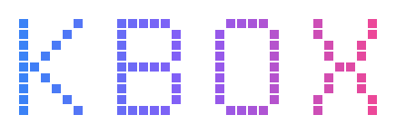

<p align="center">
  
</p>

<h3 align="center">The fastest way to deploy to Kubernetes.</h3>

<p align="center">
  
  
  
</p>

---

## Have a Dockerfile? That's all you need.

```
$ kbox up

  Detected: Dockerfile
  Building image myapp:a1b2c3d ...  done (4.2s)
  Loading into cluster ...          done (1.1s)
  Creating Deployment, Service, NetworkPolicy ...
  Streaming logs:

  myapp-6f7b8c9d-xk2p4 | listening on :8080
```

kbox turns your Dockerfile into a running Kubernetes deployment with secure defaults — in seconds, not hours.

---

## Install

### Build from Source

```bash
git clone https://github.com/bobbyrathoree/kbox.git
cd kbox
go build -o kbox ./cmd/kbox
sudo mv kbox /usr/local/bin/
```

### Verify Installation

```bash
kbox doctor
```

### Requirements

- **Docker** — for building images
- **kubectl** — configured with cluster access
- **A Kubernetes cluster** — kind, minikube, or cloud

Quick local setup:

```bash
kind create cluster
```

---

## Quick Start

### Zero-Config Deploy

```bash
cd my-app
kbox up
```

kbox will:
1. Build your Docker image
2. Load it into your cluster
3. Create secure Kubernetes resources (Deployment, Service, NetworkPolicy, etc.)
4. Stream logs in real-time

### Add a Database

```bash
kbox add postgres
```

That's it. kbox creates a StatefulSet with persistent storage and injects `DATABASE_URL` into your app.

Supported: `postgres`, `redis`, `mongodb`, `mysql`

### With Configuration

```bash
kbox init     # Create kbox.yaml from your project
kbox deploy   # Deploy to cluster
```

---

## What kbox generates

Every deployment includes hardened security defaults that pass Pod Security Standards:

```yaml
# Automatically applied to all containers
securityContext:
  runAsNonRoot: true
  readOnlyRootFilesystem: true
  allowPrivilegeEscalation: false
  capabilities:
    drop: ["ALL"]
  seccompProfile:
    type: RuntimeDefault
```

Plus: ServiceAccount (token automount disabled), NetworkPolicy, resource limits, and PDB (auto-generated when replicas > 1).

---

## Commands

```
Core:
  up              Build, deploy, and stream logs
  deploy          Deploy a pre-built image
  down            Clean teardown

Setup:
  init            Create kbox.yaml from your project
  add             Add a dependency (postgres, redis, mongodb, mysql)

Observe:
  logs            Stream logs with K8s events
  status          Show deployment status

Safety:
  validate        Check config for errors
  render          Preview generated manifests
  rollback        Revert to a previous release

Utility:
  doctor          Check your environment
  version         Show version info
```

---

## Configuration

### kbox.yaml Reference

```yaml
apiVersion: kbox.dev/v1
kind: App
metadata:
  name: myapp
  namespace: default

spec:
  # Image (required unless using kbox up)
  image: myregistry.io/myapp:v1.0.0

  # Networking
  port: 8080

  # Scaling
  replicas: 3

  # Resources
  resources:
    memory: 256Mi
    cpu: 200m
    memoryLimit: 512Mi
    cpuLimit: 500m

  # Health checks
  healthCheck: /health

  # Environment variables
  env:
    LOG_LEVEL: info
    FEATURE_FLAGS: "new-ui,dark-mode"

  # Dependencies
  dependencies:
    - type: postgres
      version: "15"
      storage: 10Gi
    - type: redis
      version: "7"

# Environment-specific overrides
environments:
  staging:
    replicas: 2
    env:
      LOG_LEVEL: debug

  production:
    replicas: 5
    resources:
      memory: 1Gi
      cpu: 500m
```

---

## Multi-Environment

Define environment overlays in a single file and deploy to any target:

```yaml
environments:
  staging:
    replicas: 2
    env:
      LOG_LEVEL: debug

  production:
    replicas: 5
    resources:
      memory: 512Mi
      cpu: 500m
    autoscaling:
      enabled: true
      minReplicas: 3
      maxReplicas: 20
```

```bash
kbox deploy -e staging       # Deploy to staging
kbox deploy -e production    # Deploy to production
```

---

## Contributing

Contributions are welcome! kbox is focused on being a fast, opinionated deploy tool for individual developers. See [CONTRIBUTING.md](CONTRIBUTING.md) for details.

```bash
git clone https://github.com/bobbyrathoree/kbox.git
cd kbox
go build ./...
go test ./...
```

---

## License

MIT License — see [LICENSE](LICENSE) for details.

---

<p align="center">
  <strong>Built for developers who'd rather ship than write YAML.</strong>
</p>
